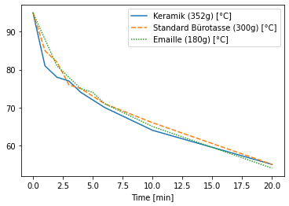
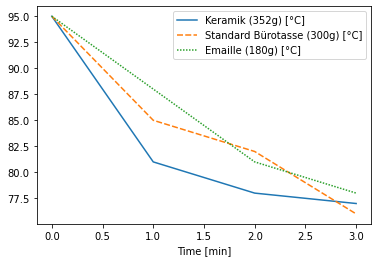
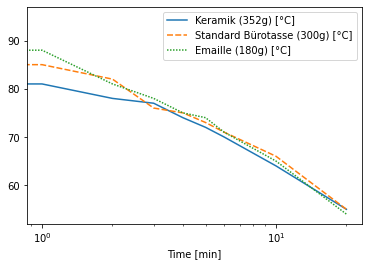

# Kaffee_vs_Tasse
Temperature Logging with a Pot of Coffee


```python
import pandas as pd

# experimental data points
df = pd.DataFrame.from_dict({'Time [min]':[0,1,2,3,4,5,6,10,20],
                             'Keramik (352g) [°C]':[95,81,78, 77,74,72,70,64,55],
                             'Standard Bürotasse (300g) [°C]':[95,85,82,76,75,73,71,66,55],
                             'Emaille (180g) [°C]':[95,88,81,78,75,74,71,65,54],
                            })
df = df.set_index('Time [min]')
parameters = {'Water (kg)':0.230, 'Gewicht (Tasse, kg)':[0.352,0.300,0.180]}
# additional data point
# 90ml Water after 1min has 76°C in a RT Keramik Tasse
display(df)
```


<div>
<style scoped>
    .dataframe tbody tr th:only-of-type {
        vertical-align: middle;
    }

    .dataframe tbody tr th {
        vertical-align: top;
    }

    .dataframe thead th {
        text-align: right;
    }
</style>
<table border="1" class="dataframe">
  <thead>
    <tr style="text-align: right;">
      <th></th>
      <th>Keramik (352g) [°C]</th>
      <th>Standard Bürotasse (300g) [°C]</th>
      <th>Emaille (180g) [°C]</th>
    </tr>
    <tr>
      <th>Time [min]</th>
      <th></th>
      <th></th>
      <th></th>
    </tr>
  </thead>
  <tbody>
    <tr>
      <th>0</th>
      <td>95</td>
      <td>95</td>
      <td>95</td>
    </tr>
    <tr>
      <th>1</th>
      <td>81</td>
      <td>85</td>
      <td>88</td>
    </tr>
    <tr>
      <th>2</th>
      <td>78</td>
      <td>82</td>
      <td>81</td>
    </tr>
    <tr>
      <th>3</th>
      <td>77</td>
      <td>76</td>
      <td>78</td>
    </tr>
    <tr>
      <th>4</th>
      <td>74</td>
      <td>75</td>
      <td>75</td>
    </tr>
    <tr>
      <th>5</th>
      <td>72</td>
      <td>73</td>
      <td>74</td>
    </tr>
    <tr>
      <th>6</th>
      <td>70</td>
      <td>71</td>
      <td>71</td>
    </tr>
    <tr>
      <th>10</th>
      <td>64</td>
      <td>66</td>
      <td>65</td>
    </tr>
    <tr>
      <th>20</th>
      <td>55</td>
      <td>55</td>
      <td>54</td>
    </tr>
  </tbody>
</table>
</div>


```python
import seaborn as sns
ax = sns.lineplot(data=df)
```


    

    


```python
ax = sns.lineplot(data=df[0:4])
```


    

    


```python
ax = sns.lineplot(data=df)
ax.set_xscale("log")
```


    

    


```python

```
